# Guía de Arquitectura — Puntual

**Versión:** 1.0  
**Proyecto:** Puntual — GAVANTI  
**Estado:** Guía base de implementación  
**Objetivo:** establecer una arquitectura pragmática, mantenible y fácil de depurar para el MVP de Puntual.

---

## 1. Propósito

Esta guía define cómo debe organizarse y evolucionar el código de Puntual.

La arquitectura prioriza:

- simplicidad operativa;
- debugging determinista;
- facilidad para que una persona o agente de IA pueda recorrer un flujo completo;
- aislamiento multi-tenant;
- separación clara entre negocio e integraciones externas;
- capacidad de cambiar proveedores sin reescribir el dominio;
- entrega incremental mediante rebanadas verticales.

### Principio rector

> **La arquitectura debe ayudar a entender el sistema, no obligar al equipo a entender la arquitectura antes de entender el sistema.**

Puntual no utilizará microservicios ni una implementación académica de Hexagonal Architecture durante el MVP.

La decisión es:

> **Monolito modular + Hexagonal pragmática + Vertical Slices + pnpm workspaces sin Turbo.**

---

# 2. Decisiones arquitectónicas

| Decisión | Elección |
|---|---|
| Backend | NestJS |
| Frontend | Next.js |
| Base de datos | PostgreSQL |
| ORM | Prisma |
| Redis | Locks, holds, colas/reintentos y expiraciones |
| WhatsApp | Meta Cloud API |
| Telegram | Telegraf |
| Calendar | Google Calendar API |
| IA | Vercel AI SDK |
| Secrets | Infisical |
| Monorepo | pnpm workspaces |
| Build orchestration | **No Turbo** |
| Arquitectura backend | Modular Monolith |
| Estilo | Hexagonal pragmática |
| Organización | Vertical Slices por capacidad/use case |
| Scheduler MVP | Cron + `scheduled_jobs` en PostgreSQL |
| Observabilidad MVP | Logs estructurados + métricas consultables |

Estas decisiones están alineadas con el Documento Técnico y el backlog ejecutable del proyecto.

---

# 3. Estructura del repositorio

La estructura inicial debe ser deliberadamente pequeña.

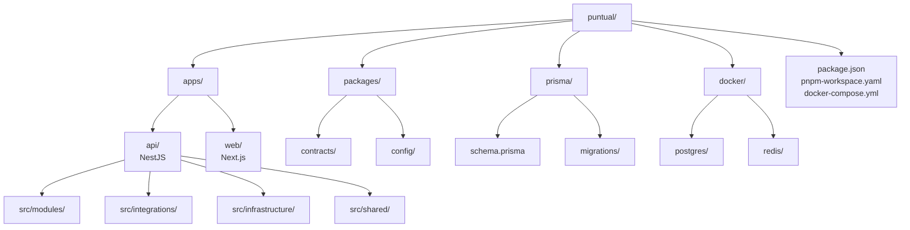

## Regla importante

No convertir cada carpeta en un package independiente.

Durante el MVP:

- `apps/api` contiene el backend completo.
- `apps/web` contiene el frontend completo.
- `packages/contracts` solo aparece si realmente existe código contractual compartido.
- `packages/config` solo contiene configuración común que tenga sentido compartir.

Extraer módulos a packages independientes debe ser una consecuencia de una necesidad real, no un requisito arquitectónico.

---

# 4. Por qué NO Turbo

Puntual no necesita Turbo durante esta etapa.

El problema que queremos evitar es introducir una capa adicional de coordinación de builds, cachés y ejecución que complique:

- debugging local;
- logs;
- ejecución individual de apps;
- diagnóstico por agentes de IA;
- comprensión del flujo del repositorio.

Con pnpm workspaces podemos mantener:

```text
apps/api
apps/web
packages/*
```

sin introducir una herramienta adicional de orquestación.

### Objetivo de debugging

Debe ser posible ejecutar el backend de forma directa:

```bash
pnpm --filter api dev
```

y el frontend:

```bash
pnpm --filter web dev
```

Un agente de IA debe poder localizar rápidamente:

```text
endpoint
  ↓
controller
  ↓
use case
  ↓
domain
  ↓
port
  ↓
adapter
  ↓
external system
```

---

# 5. Arquitectura general

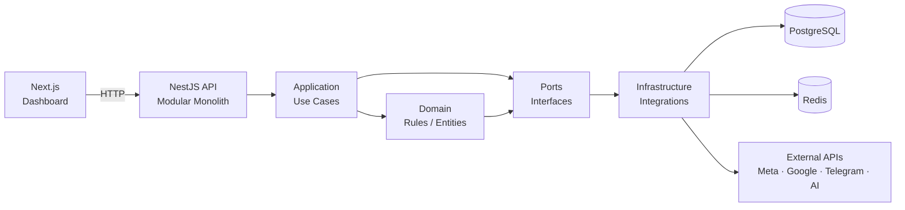

La dirección de dependencia es deliberada:

> **El negocio conoce interfaces. La infraestructura implementa esas interfaces.**

---

# 6. Modular Monolith

El backend es un único proceso desplegable de NestJS, pero internamente está dividido por módulos de negocio.

Módulos iniciales:

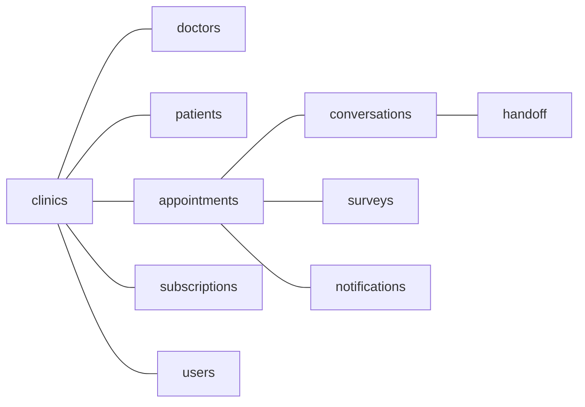

No crear módulos simplemente porque existe una tabla.

Un módulo representa una **capacidad del negocio**.

---

# 7. Vertical Slices

La unidad principal de desarrollo será el caso de uso.

Ejemplo:

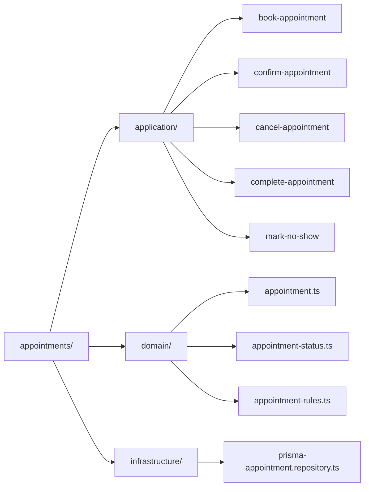

Esto permite que una historia del backlog pueda recorrerse de forma natural.

Ejemplo:

```text
E2.3 Confirmación
    ↓
ConfirmAppointmentUseCase
    ↓
Appointment rules
    ↓
AppointmentRepository
    ↓
GoogleCalendarPort
    ↓
GoogleCalendarAdapter
    ↓
Google Calendar
```

La implementación debe poder explicarse siguiendo el flujo de negocio.

---

# 8. Capas

## 8.1 Delivery / Input

Recibe entradas externas.

Ejemplos:

- REST controllers;
- Meta webhook;
- Telegram webhook;
- cron;
- acciones del dashboard.

Esta capa **no contiene reglas de negocio complejas**.

Ejemplo:

```text
MetaWebhookController
    ↓
normaliza request
    ↓
valida firma
    ↓
resuelve tenant
    ↓
invoca caso de uso
```

---

## 8.2 Application

Contiene los casos de uso.

Ejemplos:

```text
BookAppointment
ConfirmAppointment
CancelAppointment
CompleteAppointment
EscalateConversation
SendSurvey
HandleIncomingMessage
ReconfirmAppointment
```

El caso de uso coordina:

- validaciones;
- entidades;
- repositorios;
- puertos;
- transacciones;
- políticas de aplicación.

No debe conocer detalles de Meta, Google, Prisma o Redis.

---

## 8.3 Domain

Contiene reglas que pertenecen al negocio.

Ejemplos:

```text
Appointment
AppointmentStatus
Hold
Conversation
Subscription
Doctor
```

Y reglas como:

- una cita no puede completarse desde `Solicitada`;
- un hold expira;
- una cita confirmada puede cancelarse;
- una encuesta solo se dispara después de `Completada`;
- un slot no puede confirmarse dos veces.

El dominio no conoce:

```text
NestJS
Prisma
Redis
Meta
Google
Vercel AI SDK
```

---

## 8.4 Infrastructure

Implementa mecanismos concretos.

Ejemplos:

```text
PrismaAppointmentRepository
RedisAppointmentLock
PostgresScheduledJobRepository
InfisicalSecretStore
```

Aquí sí se permite conocer librerías técnicas.

---

## 8.5 Integrations

Contiene adaptadores de proveedores externos.

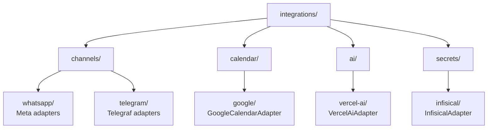

---

# 9. Ports / Interfaces

No crear interfaces para todo.

Una interfaz existe cuando hay una **frontera de cambio, proveedor externo o mecanismo intercambiable**.

## Sí usar interfaces

### ChannelPort

```text
ChannelPort
├── WhatsAppAdapter
└── TelegramAdapter
```

### CalendarPort

```text
CalendarPort
└── GoogleCalendarAdapter
```

### AiPort

```text
AiPort
└── VercelAiAdapter
```

Internamente el Vercel AI SDK puede manejar:

```text
OpenAI
Gemini
otro proveedor
fallback
```

### SecretStorePort

```text
SecretStorePort
└── InfisicalAdapter
```

Permite posteriormente migrar a un KMS sin modificar el dominio.

### JobSchedulerPort

Puede abstraerse si el mecanismo de scheduling necesita cambiar.

---

# 10. No abstraer por deporte

Evitar:

```text
LoggerPort
DateFormatterPort
StringFormatterPort
MapperPort
ValidationPort
GenericServicePort
GenericFactoryPort
```

si no existe una necesidad real.

La abstracción prematura aumenta el costo cognitivo y dificulta el debugging.

---

# 11. Channel Gateway

El Channel Gateway es una frontera especialmente importante.

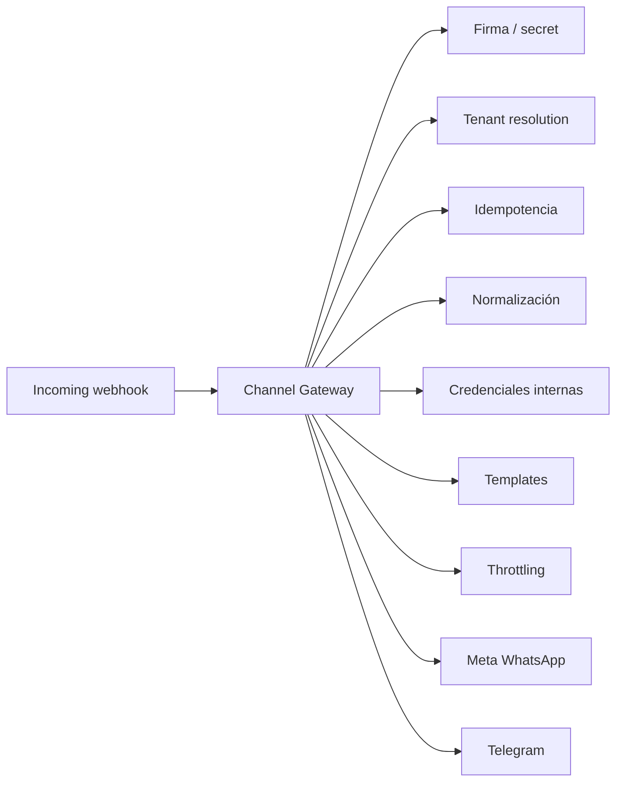

## Responsabilidades

1. Verificar firma/secret.
2. Resolver `clinicaId`.
3. Normalizar eventos.
4. Aplicar idempotencia.
5. Recuperar credenciales internamente.
6. Aplicar throttling.
7. Enviar mensajes.
8. Gestionar templates de Meta.
9. Registrar resultado y errores.

El agente de IA **nunca recibe las credenciales**.

---

# 12. Tenant Context

Todo flujo que opere sobre datos de una clínica debe tener contexto de tenant.

Conceptualmente:

```ts
TenantContext {
  clinicId: string
}
```

El contexto debe establecerse lo más cerca posible de la entrada.

Ejemplo:

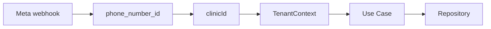

El repositorio debe evitar consultas que puedan accidentalmente cruzar tenants.

---

# 13. Multi-tenancy

Puntual utiliza aislamiento lógico por `clinicId`.

Regla:

> **Toda entidad perteneciente a una clínica debe estar vinculada a `clinicId`, directa o indirectamente, y toda consulta debe respetar el tenant context.**

Ejemplo:

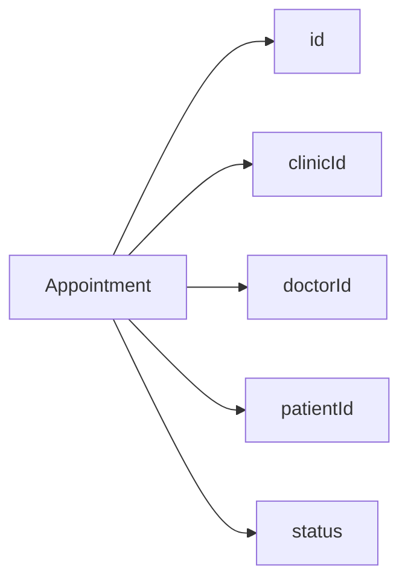

Nunca hacer:

```ts
prisma.appointment.findMany()
```

cuando la operación pertenece a una clínica.

Debe existir una restricción explícita equivalente a:

```ts
where: {
  clinicId
}
```

Los tests de aislamiento multi-tenant son obligatorios para funcionalidades que manejen datos de clínicas.

---

# 14. Appointment y concurrencia

El agendamiento es una de las zonas de mayor riesgo técnico.

Flujo:

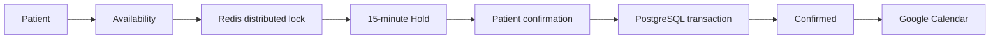

## Reglas

- El hold dura 15 minutos por defecto.
- El límite de holds simultáneos por doctor es configurable; default 3.
- Dos pacientes no pueden confirmar el mismo slot.
- El evento de Google Calendar se crea solo al confirmar.
- Un hold expirado libera el slot.
- La concurrencia debe probarse automatizadamente.

Redis protege la sección crítica.

PostgreSQL proporciona la defensa de persistencia.

---

# 15. Google Calendar

Google Calendar es la fuente de verdad operativa de disponibilidad y agenda del doctor.

La integración es:

> **unidireccional desde Puntual hacia Google Calendar.**

Puntual:

```text
crear evento
actualizar evento
eliminar/liberar evento
```

No se implementa sincronización bidireccional mediante webhooks de Google Calendar en el MVP.

El dominio solo conoce:

```text
CalendarPort
```

No:

```text
GoogleCalendarClient
```

---

# 16. IA

La IA debe estar detrás de un puerto.

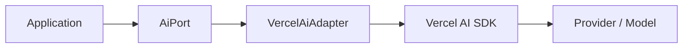

La selección de modelo debe ser configurable.

Ejemplo conceptual:

```text
AI_PROVIDER=openai
AI_MODEL=...
AI_FALLBACK_PROVIDER=gemini
AI_FALLBACK_MODEL=...
```

No hardcodear proveedores dentro de los casos de uso.

El sistema debe registrar:

- proveedor;
- modelo;
- latencia;
- tokens;
- resultado;
- error;
- `traceId`;
- `clinicId`;
- conversación relacionada.

Esto permite medir calidad/costo desde el principio sin bloquear el MVP por una decisión definitiva de proveedor.

---

# 17. Scheduler

No introducir BullMQ durante el MVP solamente porque Redis ya existe.

Para el MVP:

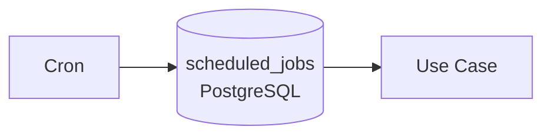

La tabla `scheduled_jobs` proporciona:

- trazabilidad;
- ejecución;
- estado;
- reintento;
- idempotencia.

Clave:

```text
tipo:clinicaId:entidadId:fechaEjecucion
```

Ejemplo:

```text
reconfirmacion:cli-12:cita-456:2026-09-14
```

BullMQ puede incorporarse posteriormente si el volumen justifica la complejidad adicional.

---

# 18. Webhooks

Los webhooks son adaptadores de entrada.

Nunca colocar lógica de negocio completa en:

```text
MetaWebhookController
TelegramWebhookController
```

Flujo:

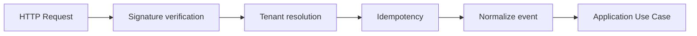

Los webhooks pueden llegar duplicados.

Por tanto:

```text
message_id / event_id
```

debe poder deduplicarse.

---

# 19. Idempotencia

Las operaciones sensibles deben poder ejecutarse más de una vez sin producir efectos duplicados.

Casos críticos:

- Meta webhook;
- Telegram webhook;
- confirmación de cita;
- envío de notificación;
- jobs programados;
- reconfirmaciones;
- encuestas;
- transición No-show;
- cambios de suscripción.

Regla:

> **Todo proceso externo que pueda reintentarse debe tener una estrategia explícita de idempotencia.**

---

# 20. API interna

Los módulos internos nunca llaman directamente a APIs externas.

Correcto:

```text
Agent
  ↓
Puntual API / Application
  ↓
CalendarPort
  ↓
GoogleCalendarAdapter
```

Incorrecto:

```text
Agent
  ↓
Google Calendar API
```

Incorrecto:

```text
Next.js
  ↓
Meta API
```

Incorrecto:

```text
Next.js
  ↓
Google Calendar API
```

Toda integración externa pasa por Puntual.

---

# 21. REST endpoints

Los endpoints se derivan de los casos de uso.

No diseñar el negocio alrededor de URLs.

Ejemplos:

```text
POST /webhooks/meta
POST /webhooks/telegram

GET  /appointments/today
POST /appointments
PATCH /appointments/:id
POST /appointments/:id/confirm
POST /appointments/:id/cancel
POST /appointments/:id/complete

GET  /conversations
POST /conversations/:id/messages
POST /conversations/:id/resolve

GET  /doctors
POST /doctors
PATCH /doctors/:id

GET  /clinics
POST /clinics
```

Los nombres exactos pueden evolucionar con el diseño de los casos de uso.

La regla permanece:

> **Use case primero; endpoint después.**

---

# 22. Debugging como requisito arquitectónico

La arquitectura de Puntual debe ser amigable para debugging humano y asistido por IA.

Cada flujo operativo debe poder reconstruirse mediante IDs.

Como mínimo:

```text
traceId
requestId
clinicId
conversationId
patientId
appointmentId
jobId
```

No todos tienen que existir en todos los flujos, pero los disponibles deben propagarse.

Ejemplo:

```json
{
  "level": "info",
  "traceId": "tr_123",
  "requestId": "req_456",
  "clinicId": "cli_12",
  "conversationId": "conv_88",
  "appointmentId": "apt_991",
  "useCase": "ConfirmAppointment",
  "event": "appointment.confirmed"
}
```

## Objetivo

Poder decir:

> “Busca `traceId=tr_123` y explícame por qué falló el booking.”

y que el recorrido sea suficientemente claro para reconstruir:

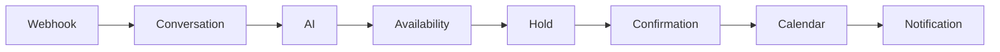

---

# 23. Logging

Preferir logs estructurados JSON.

Evitar logs como:

```text
"algo salió mal"
```

Preferir:

```json
{
  "level": "error",
  "event": "calendar.create_event.failed",
  "clinicId": "cli_12",
  "appointmentId": "apt_991",
  "provider": "google-calendar",
  "errorCode": "403",
  "traceId": "tr_123"
}
```

Los logs deben ser útiles tanto para:

- desarrolladores;
- debugging local;
- staging;
- agentes de IA;
- métricas operativas.

---

# 24. Errores

Los errores deben conservar contexto.

Un adapter externo debe traducir errores del proveedor a errores entendibles por la aplicación cuando corresponda.

Ejemplo:

```text
Google 403
   ↓
CalendarAuthorizationError
   ↓
Application handling
   ↓
structured log
```

No propagar indiscriminadamente errores específicos de SDK por todo el dominio.

---

# 25. Transacciones

Usar transacciones de PostgreSQL cuando varias escrituras deban mantener consistencia.

Ejemplo:

```text
ConfirmAppointment
    ├── verificar hold
    ├── cambiar estado
    ├── registrar confirmación
    └── registrar referencia de calendar
```

La interacción con proveedores externos no debe asumir que una transacción PostgreSQL puede abarcar Google/Meta.

Por tanto, los casos donde exista:

```text
DB + external API
```

deben diseñarse explícitamente para manejar fallos parciales.

---

# 26. Seguridad

Reglas obligatorias:

- ningún secreto en Git;
- secretos gestionados mediante Infisical;
- credenciales de canales cifradas;
- clave maestra solo en secrets del deployment;
- firma de webhook antes de lógica de negocio;
- tenant isolation;
- rate limiting en endpoints públicos;
- throttling por tenant;
- auditoría de acciones administrativas;
- no exponer credenciales al agente;
- no exponer APIs externas directamente al frontend.

---

# 27. Frontend

Next.js es el cliente del API de Puntual.

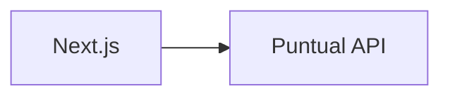

El frontend no debe contener reglas de negocio críticas.

El frontend puede:

- presentar;
- validar UX;
- manejar estado de UI;
- enviar comandos al API.

El backend es la autoridad para:

- permisos;
- tenant;
- disponibilidad;
- citas;
- estados;
- handoff;
- suscripciones.

---

# 28. Autenticación

El dashboard utiliza autenticación segura.

Conceptualmente:

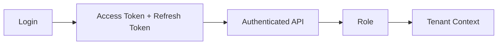

Roles:

```text
SUPER_ADMIN
CLINIC_ADMIN
DOCTOR
```

El paciente no tiene acceso al dashboard.

---

# 29. Prisma

Prisma será el mecanismo de persistencia del backend.

Regla:

> Prisma pertenece a Infrastructure, no al Domain.

Por ejemplo:

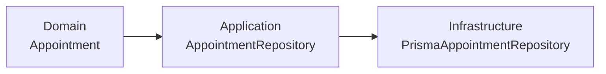

El caso de uso no debe depender directamente de:

```ts
PrismaClient
```

cuando exista una frontera de persistencia relevante.

No crear repositorios genéricos innecesarios.

---

# 30. Testing

La estrategia debe seguir el riesgo.

## Unit tests

Para:

- reglas de dominio;
- estados;
- validaciones;
- cálculo de disponibilidad;
- políticas.

## Integration tests

Para:

- Prisma;
- PostgreSQL;
- Redis;
- repositorios;
- locks;
- idempotencia.

## End-to-end

Para flujos completos:

```text
Webhook
→ Agent
→ Availability
→ Hold
→ Confirm
→ Calendar
→ Notification
```

## Tests obligatorios de alto riesgo

- aislamiento tenant;
- doble confirmación concurrente;
- expiración de hold;
- webhook duplicado;
- firma inválida;
- reintento de proveedor;
- transición de estados;
- idempotencia de jobs.

---

# 31. Observabilidad MVP

No crear inicialmente una plataforma de observabilidad completa.

El MVP necesita:

```text
Structured logs
+
Trace/correlation IDs
+
Aggregated metrics
+
Healthcheck
```

Métricas importantes:

- fallas;
- latencia p50/p95;
- resolución autónoma;
- citas;
- satisfacción;
- hold → confirmada;
- costo LLM;
- costo de templates Meta.

OpenObserve/OpenTelemetry pueden evaluarse posteriormente si el volumen lo justifica.

---

# 32. Regla de evolución

Una decisión arquitectónica puede cambiar.

Lo importante es que el cambio quede detrás de una frontera estable cuando exista una razón real.

Ejemplo:

```text
CalendarPort
    ↓
Google Calendar
```

puede evolucionar a:

```text
CalendarPort
    ├── GoogleCalendarAdapter
    └── FutureCalendarAdapter
```

sin cambiar el caso de uso.

Lo mismo:

```text
AiPort
    ├── VercelAiAdapter
    └── FutureAiAdapter
```

y:

```text
SecretStorePort
    ├── InfisicalAdapter
    └── KmsAdapter
```

---

# 33. Lo que NO construiremos todavía

Durante el MVP evitar:

- microservicios;
- Kubernetes;
- Turbo;
- BullMQ sin necesidad;
- event bus genérico;
- CQRS completo;
- Event Sourcing;
- repositorios genéricos;
- arquitectura de plugins interna;
- plataforma de observabilidad compleja;
- abstracciones para cada librería;
- sincronización bidireccional con Google Calendar.

La complejidad debe aparecer como respuesta a una necesidad demostrada.

---

# 34. Regla para introducir una nueva abstracción

Antes de crear un nuevo `Port`, `Adapter`, `Factory` o `Package`, responder:

1. ¿Existe más de una implementación?
2. ¿Existe una posibilidad razonable de cambiar de proveedor?
3. ¿Aísla una dependencia externa?
4. ¿Mejora significativamente los tests?
5. ¿Reduce el acoplamiento de un caso de uso importante?

Si la respuesta es no a todas:

> probablemente no necesitamos la abstracción todavía.

---

# 35. Flujo de referencia: CU-001

El caso de uso más importante del MVP debe verse aproximadamente así:

```text
WhatsApp / Telegram
        │
        ▼
Webhook Controller
        │
        ├── signature
        ├── tenant resolution
        └── idempotency
        │
        ▼
HandleIncomingMessage
        │
        ▼
Conversation
        │
        ▼
AI Agent
        │
        ▼
BookAppointment
        │
        ├── specialty
        ├── doctor
        ├── availability
        │
        ▼
Redis Hold
        │
        ▼
Patient Confirmation
        │
        ▼
ConfirmAppointment
        │
        ├── PostgreSQL
        ├── Google Calendar
        └── Doctor notification
        │
        ▼
WhatsApp / Telegram
```

Este flujo debe ser el primer gran referente para validar la arquitectura.

---

# 36. Relación con el backlog

La arquitectura debe acompañar el orden de ejecución del backlog:

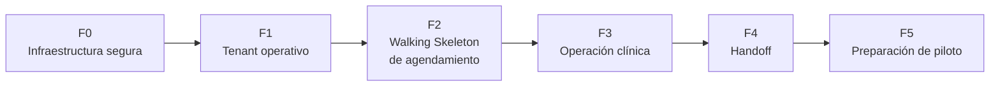

No crear arquitectura para funcionalidades futuras antes de que sean necesarias.

El Sprint 1 debe establecer la fundación suficiente para que los siguientes vertical slices puedan construirse sin rehacer la base.

---

# 37. Definition of Done arquitectónica

Una historia que modifica arquitectura debe dejar:

- código integrado;
- tests apropiados;
- tenant isolation cuando aplique;
- logs estructurados;
- trace/correlation ID cuando el flujo sea operativo;
- errores externos manejados;
- migraciones Prisma cuando correspondan;
- configuración documentada;
- staging validado;
- ningún secreto en el repositorio.

---

# 38. Checklist antes de aprobar un PR

### Estructura

- [ ] El código está en el módulo de negocio correcto.
- [ ] El caso de uso es identificable.
- [ ] No se introdujo una abstracción innecesaria.
- [ ] Las dependencias apuntan en la dirección correcta.

### Seguridad

- [ ] Tenant context está presente.
- [ ] No hay credenciales expuestas.
- [ ] Los endpoints respetan autorización.
- [ ] Los webhooks validan origen.

### Integraciones

- [ ] Las APIs externas están detrás de adapters/ports cuando corresponde.
- [ ] Los errores externos están controlados.
- [ ] Existe idempotencia donde aplica.
- [ ] Hay estrategia de retry cuando corresponde.

### Debugging

- [ ] Logs estructurados.
- [ ] `traceId`/`requestId` disponible.
- [ ] `clinicId` disponible cuando aplica.
- [ ] Entidad principal identificable.

### Testing

- [ ] Tests unitarios donde hay reglas.
- [ ] Tests de integración donde hay infraestructura.
- [ ] Tests de concurrencia para booking cuando aplica.
- [ ] Tests de aislamiento tenant cuando aplica.

---

# 39. Principios finales

## 1. Simplicidad primero

No necesitamos una arquitectura impresionante.

Necesitamos una arquitectura que podamos operar.

## 2. El negocio manda

Los módulos representan capacidades del negocio, no tecnologías.

## 3. Interfaces donde existe cambio

Las interfaces protegen fronteras reales.

## 4. Vertical slices sobre capas gigantes

Preferimos entender un flujo completo antes que construir una capa perfecta.

## 5. Debugging es una feature

Si un humano o un agente de IA no puede seguir un flujo, la arquitectura está fallando.

## 6. Un monolito no significa desorden

Puntual será un solo deploy de backend, pero con límites internos claros.

## 7. Redis y PostgreSQL tienen responsabilidades diferentes

Redis protege concurrencia, holds y mecanismos temporales.

PostgreSQL conserva la verdad persistente.

## 8. Los proveedores son reemplazables

Meta, Google, IA, secrets y futuros pagos están detrás de fronteras cuando existe una razón real.

## 9. No anticipar escala ficticia

Primero resolver la clínica piloto.

Después resolver los problemas que aparezcan con datos reales.

---

# 40. Decisión arquitectónica resumida

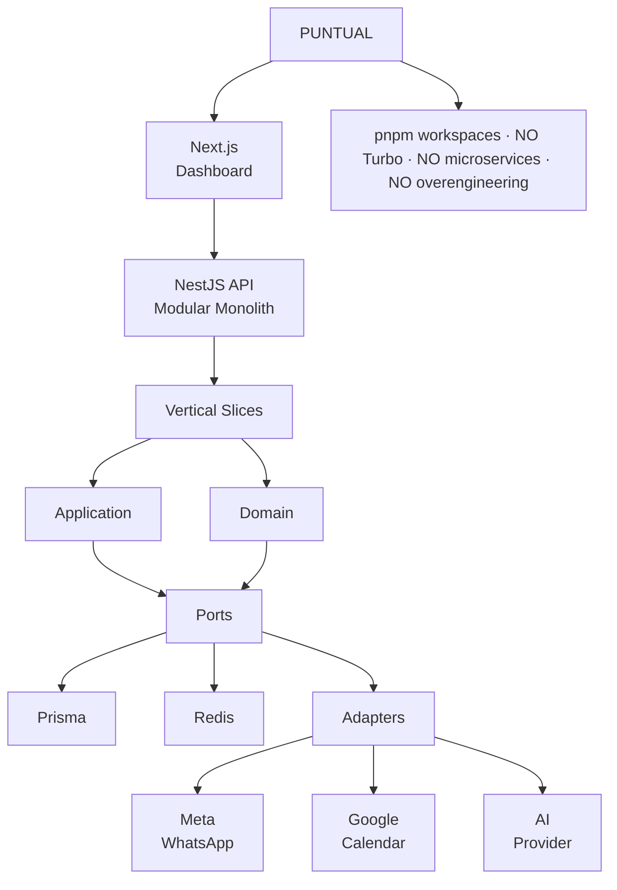


> **Puntual debe ser suficientemente modular para cambiar y suficientemente simple para entender.**

Ese es el criterio que debe gobernar cualquier decisión arquitectónica futura.
